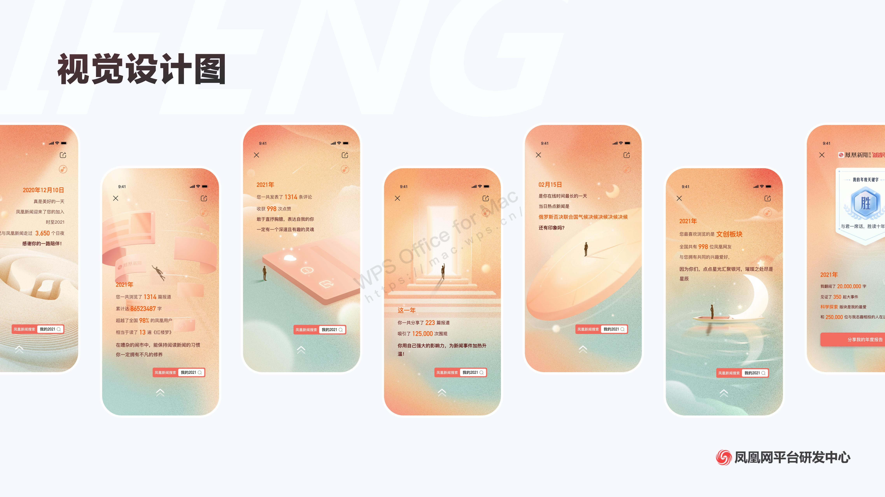

# 凤凰回忆之旅

开启 2021 年凤凰年度回忆之旅，回味 2021 年的凤凰时光旅程。

在年度报告的回顾页面中，展示在凤凰新闻中的点滴记录。

比如可以看到自己最喜爱的版块，一年中的最长的在线时长及当日热点，过去一年发布了多少评论文章，点赞了多少个热点新闻等等，满满的回忆感。

最后一页，页面还会生成专属的个性关键词海报。生成完毕后，就可以看到凤凰新闻对自己一年的评价。同时也可以将关键词海报分享给好友。

> 项目预览链接：https://xinjn.github.io/fengMemory/

# 项目分析

